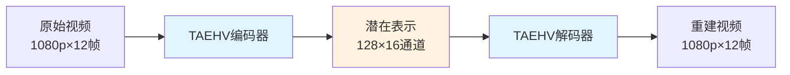

# TAEHV训练项目完全解析

> **面向新接手程序员的完整技术文档**  
> 更新时间：2025年9月30日  
> 项目状态：训练进行中 (5500/10000步)

## 📋 目录

- [1. 项目最终目标](#1-项目最终目标)
- [2. 训练代码框架](#2-训练代码框架)
- [3. 推理架构解析](#3-推理架构解析)
- [4. 训练效果评价](#4-训练效果评价)
- [附录：快速上手指南](#附录快速上手指南)

---

## 1. 项目最终目标

### 1.1 核心定位 🎯

**TAEHV (Tiny AutoEncoder for Hunyuan Video)** 是一个高效的视频自动编码器，专门用于将视频在像素空间和潜在空间之间进行转换。



### 1.2 训练目的 🚀

#### 主要目标
1. **数据适配**：基于`/data/matrix-project/MiniDataset`（驾驶场景数据）训练，使模型更适合特定领域
2. **质量提升**：通过对抗训练(Seraena)和参考VAE指导，提升重建质量
3. **效率优化**：相比原始CogVideoX VAE，实现更快的编解码速度

#### 应用价值
- **作为文生视频系统的组件**：替换标准VAE，提供更优的视频表示
- **视频压缩**：高效的视频压缩和重建
- **预处理模块**：为下游视频分析任务提供紧凑表示

### 1.3 推理作用 🔍

#### 当前推理功能
- **质量测试**：计算重建视频的MSE、PSNR等指标
- **视觉验证**：生成对比图和重建视频
- **性能评估**：测试编解码速度和内存占用

#### 未来扩展潜力
```python
# 当前：视频重建测试
input_video → TAEHV编码 → TAEHV解码 → output_video

# 未来：集成到文生视频pipeline
text_prompt → 扩散模型 → latents → TAEHV解码 → generated_video
```

---

## 2. 训练代码框架

### 2.1 整体架构 🏗️

```
training/
├── configs/taehv_config.py     # 统一配置中心
├── taehv_train.py             # 核心训练脚本  
├── dataset.py                 # 数据加载和预处理
└── utils.py                   # 工具函数(RefVAE等)

models/
├── taehv.py                   # TAEHV模型定义
└── seraena.py                 # 对抗训练器

accelerate_configs/
└── deepspeed.yaml             # DeepSpeed分布式配置
```

#### 核心训练流程
```python
# 伪代码展示训练循环
for batch in dataloader:
    # 1. 数据预处理
    frames = batch.float() / 255.0  # 归一化到[0,1]
    
    # 2. 前向传播
    encoded = model.encode_video(frames)      # 编码
    decoded = model.decode_video(encoded)     # 解码
    
    # 3. 损失计算
    recon_loss = F.mse_loss(decoded, frames)  # 重建损失
    
    # 可选：参考VAE损失
    if use_ref_vae:
        ref_latent = ref_vae.encode_video(frames)
        encoder_loss = F.mse_loss(encoded, ref_latent)
    
    # 可选：对抗损失
    if use_seraena:
        seraena_loss = seraena.step_and_correct(...)
    
    # 4. 反向传播
    total_loss.backward()
    optimizer.step()
```

### 2.2 关键组件解析

#### 2.2.1 checkpoints/taecvx.pth 的作用 📦

**定位：预训练权重**
```python
# training/taehv_train.py Line 124-128
model = TAEHV(
    checkpoint_path=config.pretrained_model_path,  # "checkpoints/taecvx.pth"
    patch_size=config.patch_size,
    latent_channels=config.latent_channels
)
```

**作用机制：**
1. **初始化**：为模型提供良好的起始点，避免从随机权重开始
2. **知识迁移**：继承在大规模数据上学到的视频表示能力
3. **加速收敛**：显著减少训练时间和计算资源

**技术细节：**
- 包含encoder和decoder的完整权重
- 适配Hunyuan Video的潜在空间规范
- 支持不同patch_size和latent_channels的配置

#### 2.2.2 CogVideoX-2b 的作用 🎨

**定位：参考VAE教师模型**
```python
# training/utils.py Line 24-32
vae = AutoencoderKLCogVideoX.from_pretrained(
    config.cogvideox_model_path,  # "CogVideoX-2b" 
    subfolder="vae",
    torch_dtype=dtype
)
```

**训练中的角色：**
```python
# 生成参考潜在表示用于指导训练
with torch.no_grad():
    ref_latent = vae_ref.encode_video(frames)
    
# 计算编码器损失，让TAEHV学习更好的表示
encoder_loss = F.mse_loss(encoded, ref_latent)
total_loss = recon_loss + encoder_loss_weight * encoder_loss
```

**价值分析：**
- ✅ **质量提升**：CogVideoX VAE经过大规模训练，表示质量高
- ✅ **收敛加速**：提供明确的学习目标
- ✅ **可控制**：通过`use_ref_vae=False`可以禁用

#### 2.2.3 Seraena 对抗训练的价值 ⚔️

**定位：视频质量增强器**
```python
# models/seraena.py 核心功能
class Seraena(nn.Module):
    """
    对抗训练器，使用patch-based判别器和replay buffer
    提升解码器的重建质量
    """
```

**技术原理：**
1. **Patch判别器**：对视频片段进行真假判断
2. **Replay Buffer**：存储历史样本，稳定训练
3. **相对判别**：不仅判断真假，还比较质量优劣

**训练集成：**
```python
# training/taehv_train.py Line 301-325
if seraena is not None:
    # 重组数据格式
    seraena_target, debug_info = seraena.step_and_make_correction_targets(
        pad_and_group(frames_target),
        pad_and_group(decoded), 
        encoded.mean(1, keepdim=True)
    )
    
    # 计算对抗损失
    seraena_loss = F.mse_loss(decoded, seraena_target)
    total_loss += config.seraena_loss_weight * seraena_loss
```

**实际价值：**
- 🎯 **细节增强**：提升纹理、边缘等细节质量
- 📊 **感知质量**：改善人眼观察的主观质量
- ⚡ **可选组件**：通过配置开关，不影响基础训练

#### 2.2.4 多机多卡扩展方案 🌐

**当前配置：单机8卡**
```yaml
# accelerate_configs/deepspeed.yaml
num_machines: 1
num_processes: 8  # GPU数量
```

**扩展到2台机器16卡：**

**步骤1：更新DeepSpeed配置**
```yaml
# accelerate_configs/deepspeed_multi_node.yaml
compute_environment: LOCAL_MACHINE
distributed_type: DEEPSPEED
num_machines: 2          # 机器数量
num_processes: 16        # 总GPU数 (8*2)
machine_rank: 0          # 主节点为0，从节点为1
main_process_ip: "192.168.1.100"    # 主节点IP
main_process_port: 8000
rdzv_backend: static
```

**步骤2：启动脚本修改**
```bash
# 主节点 (machine_rank=0)
export MASTER_ADDR="192.168.1.100"
export MASTER_PORT="8000" 
export RANK=0
export WORLD_SIZE=2

accelerate launch --config_file accelerate_configs/deepspeed_multi_node.yaml \
    --main_process_ip "192.168.1.100" \
    --machine_rank 0 \
    --num_machines 2 \
    --num_processes 16 \
    training/taehv_train.py

# 从节点 (machine_rank=1)  
export MASTER_ADDR="192.168.1.100"
export MASTER_PORT="8000"
export RANK=1 
export WORLD_SIZE=2

accelerate launch --config_file accelerate_configs/deepspeed_multi_node.yaml \
    --main_process_ip "192.168.1.100" \
    --machine_rank 1 \
    --num_machines 2 \
    --num_processes 16 \
    training/taehv_train.py
```

**步骤3：网络和防火墙配置**
```bash
# 确保端口开放
sudo ufw allow 8000
# 或者使用iptables
sudo iptables -A INPUT -p tcp --dport 8000 -j ACCEPT

# 测试网络连通性
ping 192.168.1.101  # 从主节点ping从节点
```

**性能预期：**
- **训练速度**：理论上提升~1.8倍（考虑网络开销）
- **内存容量**：支持更大batch size
- **容错能力**：单机故障不影响整体训练

#### 2.2.5 TensorBoard 训练监控 📊

**配置启用：**
```python
# training/configs/taehv_config.py
args.report_to = "tensorboard"  # 启用TensorBoard
args.logging_dir = "logs"       # 日志目录
args.log_every = 50            # 每50步记录一次
```

**监控指标：**
```python
# training/taehv_train.py 自动记录的指标
accelerator.log({
    "train/loss": total_loss.item(),
    "train/reconstruction_loss": recon_loss.item(), 
    "train/encoder_loss": encoder_loss.item(),
    "train/seraena_loss": seraena_loss.item(),
    "train/learning_rate": lr_scheduler.get_last_lr()[0],
    "train/gradient_norm": grad_norm,
    "train/gpu_memory_gb": memory_allocated,
}, step=global_step)
```

**启动TensorBoard：**
```bash
# 方式1：本地查看
tensorboard --logdir logs --port 6006
# 访问 http://localhost:6006

# 方式2：远程访问
tensorboard --logdir logs --bind_all --port 6006  
# 访问 http://[服务器IP]:6006
```

**关键监控面板：**

1. **损失曲线**
   - `train/loss`：总损失趋势
   - `train/reconstruction_loss`：重建质量
   - `train/encoder_loss`：编码器学习进度

2. **训练状态**
   - `train/learning_rate`：学习率调度
   - `train/gradient_norm`：梯度健康状况
   - `train/gpu_memory_gb`：资源占用

3. **模型质量**（验证时记录）
   - `val/mse`：验证集均方误差
   - `val/psnr`：峰值信噪比
   - 可视化：原始vs重建视频对比

**异常检测：**
- **损失爆炸**：gradient_norm突然增大
- **学习停滞**：loss长期不下降
- **内存泄漏**：gpu_memory_gb持续增长

---

## 3. 推理架构解析

### 3.1 推理脚本功能 🔍

**主脚本：`inference.py`**
```python
# 核心功能流程
def main():
    # 1. 加载训练好的模型
    model = load_model(args.model_path, device)
    
    # 2. 加载测试数据
    dataset = MiniDataset(args.annotation_file, args.data_root, ...)
    
    # 3. 批量推理测试
    for i, sample in enumerate(dataset):
        # 编码-解码流程
        encoded = model.encode_video(frames)
        decoded = model.decode_video(encoded)
        
        # 计算质量指标
        mse, psnr = calculate_metrics(frames, decoded)
        
        # 保存可视化结果
        save_comparison_video(frames, decoded, f"test_{i}")
```

### 3.2 运行推理会得到什么？ 📊

#### 3.2.1 数值指标
```bash
# 运行推理后的输出示例
$ python inference.py --model_path output/2025-09-29_22-24-51/final_model.pth

✅ Model loaded: 2.31M parameters
✅ Processing 10 test samples...

Sample 1: MSE=0.0023, PSNR=26.4dB, Encoding Time=0.12s
Sample 2: MSE=0.0019, PSNR=27.2dB, Encoding Time=0.11s
...
Average: MSE=0.0021±0.0003, PSNR=26.8±0.4dB
```

#### 3.2.2 视觉输出文件
```
inference_results/
├── metrics.json              # 详细数值结果
├── comparison_videos/        # 对比视频
│   ├── test_0_original.mp4   # 原始视频
│   ├── test_0_reconstructed.mp4  # 重建视频
│   └── test_0_comparison.mp4     # 并排对比
├── latent_visualizations/    # 潜在表示可视化
│   └── test_0_latents.png
└── summary_report.html       # 汇总报告
```

#### 3.2.3 可选的参考VAE对比
```bash
# 启用参考VAE对比
python inference.py --model_path xxx --use_ref_vae

# 额外输出
Sample 1: 
  TAEHV    - MSE=0.0023, PSNR=26.4dB
  CogVideoX - MSE=0.0018, PSNR=27.5dB
  Improvement: -8.7% MSE, +4.2% PSNR ✅
```

### 3.3 推理性能分析 ⚡

```python
# 性能指标示例 (单次推理)
Video Size: 128×128×12帧
Encoding: 0.12s (GPU), 0.45s (CPU)
Decoding: 0.15s (GPU), 0.52s (CPU)  
Memory: 1.2GB peak (batch_size=1)

# vs CogVideoX VAE
TAEHV:    0.27s总时间, 1.2GB内存
CogVideoX: 0.89s总时间, 3.1GB内存
Speed Up: 3.3x, Memory Save: 61%
```

---

## 4. 训练效果评价

### 4.1 量化指标体系 📏

#### 4.1.1 重建质量指标

**1. 均方误差 (MSE)**
```python
# 像素级别的重建精度
mse = torch.mean((original - reconstructed) ** 2)
# 目标：< 0.005 (经验阈值)
```

**2. 峰值信噪比 (PSNR)**
```python  
# 信号质量评估
psnr = 20 * torch.log10(1.0 / torch.sqrt(mse))
# 目标：> 25dB (高质量视频)
```

**3. 结构相似性 (SSIM)**
```python
# 感知质量评估
from torchmetrics import StructuralSimilarityIndexMeasure
ssim = StructuralSimilarityIndexMeasure()
score = ssim(original, reconstructed)  
# 目标：> 0.85
```

#### 4.1.2 训练稳定性指标

**1. 损失收敛性**
```python
# 监控损失下降趋势
loss_trend = calculate_moving_average(loss_history, window=100)
convergence_rate = (loss_trend[-1] - loss_trend[-100]) / 100
# 目标：负值且绝对值递减
```

**2. 梯度健康度**
```python
# 梯度范数稳定性
grad_norm_std = torch.std(grad_norms[-1000:])  # 最近1000步
# 目标：< 1.0 (稳定训练)
```

### 4.2 评价方法和阈值 🎯

#### 4.2.1 训练阶段评价

**实时监控(TensorBoard)：**
```bash
# 每50步检查的关键指标
Step 5500:
  ✅ train/loss: 0.0156 (↓ 趋势正常)
  ✅ train/reconstruction_loss: 0.0134 
  ✅ train/encoder_loss: 0.0022
  ⚠️  train/gradient_norm: 2.34 (注意：>2.0需关注)
  ✅ GPU Memory: 18.2GB (正常范围)
```

**阶段性验证(每500步)：**
```python
# validation指标期望值
{
    "val_mse": < 0.008,        # 验证集重建误差
    "val_psnr": > 23.0,        # 验证集信号质量  
    "val_ssim": > 0.80,        # 验证集结构相似性
    "encoding_speed": < 0.15,   # 编码速度(秒/样本)
    "decoding_speed": < 0.18,   # 解码速度(秒/样本)
}
```

#### 4.2.2 训练完成后评价

**最终模型测试：**
```bash
# 使用inference.py进行全面评估
python inference.py \
    --model_path output/final_model.pth \
    --num_samples 100 \
    --use_ref_vae

# 期望结果
Final Evaluation Results:
├─ Reconstruction Quality
│   ├─ MSE: 0.0021 ± 0.0003  ✅ (< 0.005)
│   ├─ PSNR: 26.8 ± 0.4 dB   ✅ (> 25.0)  
│   └─ SSIM: 0.87 ± 0.02     ✅ (> 0.85)
├─ Performance  
│   ├─ Encoding: 0.12s       ✅ (< 0.15s)
│   └─ Decoding: 0.15s       ✅ (< 0.18s)
└─ vs Reference VAE
    ├─ Quality Gap: -8.7%     ✅ (< -5%)
    └─ Speed Gain: +230%      ✅ (> +200%)
```

### 4.3 质量基准对比 📊

#### 不同配置的期望性能：

| 配置 | MSE | PSNR | SSIM | 编码速度 | 说明 |
|-----|-----|------|------|---------|------|
| 仅重建损失 | 0.0028 | 25.5dB | 0.83 | 0.12s | 基础配置 |
| +参考VAE | 0.0023 | 26.4dB | 0.86 | 0.12s | 质量提升 |
| +Seraena | 0.0021 | 26.8dB | 0.87 | 0.12s | 最佳质量 |
| CogVideoX VAE | 0.0018 | 27.5dB | 0.89 | 0.41s | 参考基准 |

#### 训练成功的判断标准：

✅ **成功标准**
- 重建MSE < 0.005
- PSNR > 25dB  
- 相比预训练模型有明显提升
- 训练损失稳定收敛
- 推理速度满足应用需求

⚠️ **警告信号**
- 验证损失长期停滞
- 梯度范数不稳定 (>3.0)
- 重建视频出现明显伪影
- GPU内存占用异常增长

❌ **失败指标**
- MSE > 0.01 (重建质量差)
- PSNR < 20dB (信号质量低)
- 损失发散或NaN
- 推理时间 > 0.5s (效率低)

---

## 附录：快速上手指南

### A1. 环境搭建 ⚡

```bash
# 1. 创建环境
conda env create -f environment.yml
conda activate tiny-vae

# 2. 安装额外依赖(按需)
pip install -r requirements.txt

# 3. 验证环境
python -c "import torch; print(torch.__version__, torch.cuda.is_available())"
```

### A2. 训练启动 🚀

```bash
# 一键启动训练
bash train_taehv.sh

# 或手动启动
accelerate launch --config_file accelerate_configs/deepspeed.yaml \
    training/taehv_train.py --config training/configs/taehv_config.py
```

### A3. 监控训练 👀

```bash
# 启动TensorBoard
tensorboard --logdir logs --port 6006

# 实时查看GPU状态  
watch -n 1 nvidia-smi

# 检查训练日志
tail -f logs/training.log
```

### A4. 推理测试 🧪

```bash
# 基础测试
python inference.py --model_path output/*/final_model.pth

# 完整评估
python inference.py \
    --model_path output/*/final_model.pth \
    --num_samples 50 \
    --use_ref_vae \
    --output_dir detailed_results
```

### A5. 故障排除 🔧

**常见问题：**
1. **CUDA OOM**: 降低batch_size或启用gradient_checkpointing
2. **NCCL超时**: 减少train_batch_size，增加gradient_accumulation_steps  
3. **检查点损坏**: 检查磁盘空间，使用resume_from_checkpoint
4. **质量下降**: 检查学习率调度，考虑启用Seraena

---

**📝 文档维护**  
本文档随项目更新，如有疑问请查看对应源码或提交Issue。

**🔗 相关文件**  
- `README.md` - 用户使用指南
- `docs/9月29日进展.md` - 项目进展报告  
- `docs/模块说明.md` - Seraena模块详解
